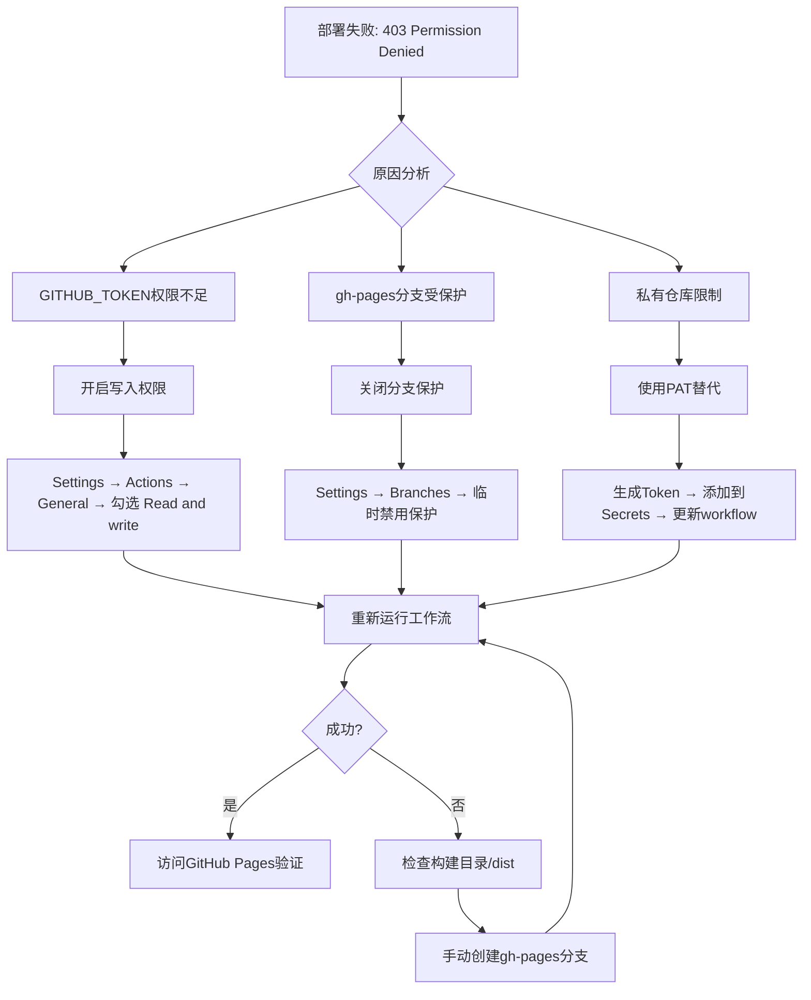

以下是使用 **Mermaid** 绘制的流程图，清晰展示问题诊断与解决步骤：

```mermaid
flowchart TD
    A[部署失败: 403 Permission Denied] --> B{原因分析}
    B --> C1[GITHUB_TOKEN权限不足]
    B --> C2[gh-pages分支受保护]
    B --> C3[私有仓库限制]

    C1 --> D1[开启写入权限]
    D1 --> E1[Settings → Actions → General → 勾选 Read and write]
    
    C2 --> D2[关闭分支保护]
    D2 --> E2[Settings → Branches → 临时禁用保护]
    
    C3 --> D3[使用PAT替代]
    D3 --> E3[生成Token → 添加到Secrets → 更新workflow]

    E1 --> F[重新运行工作流]
    E2 --> F
    E3 --> F

    F --> G{成功?}
    G -->|是| H[访问GitHub Pages验证]
    G -->|否| I[检查构建目录/dist]
    I --> J[手动创建gh-pages分支]
    J --> F
```

### 图表说明：
1. **逻辑路径**：从错误出发，分3种原因展开解决方案。
2. **关键操作**：用绿色矩形标出GitHub后台的具体操作位置。
3. **循环验证**：失败时可检查构建目录或手动初始化分支。
4. **简洁提示**：所有操作最终指向重新运行工作流验证。
